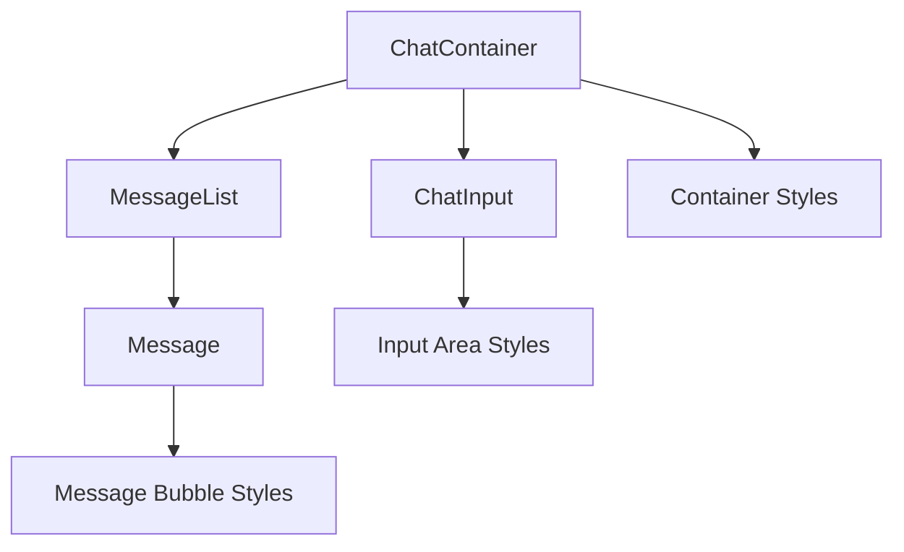

# Design Document: Chat UI Redesign

## Overview

Редизайн интерфейса чата направлен на создание современного, визуально привлекательного и удобного пользовательского опыта. Текущий минималистичный дизайн будет обновлён с добавлением визуальной глубины, улучшенной цветовой схемы и современных UI-паттернов, сохраняя при этом существующую функциональность на базе Mantine UI.

## Architecture

Редизайн затрагивает только презентационный слой без изменения бизнес-логики:



Изменения будут внесены в:
- `Chat.module.css` — основные стили компонентов
- `index.css` — CSS-переменные для цветовой схемы
- Компоненты React — минимальные изменения для добавления классов

## Components and Interfaces

### ChatContainer
Основной контейнер чата получит:
- Фоновый цвет/градиент
- Тень для визуального отделения
- Скруглённые углы
- Внутренние отступы

### Message Component
Пузырьки сообщений будут обновлены:
- Различные цветовые схемы для user/assistant
- Тени для глубины
- Улучшенные скругления
- Плавные анимации появления

### ChatInput Component
Область ввода получит:
- Современную границу с градиентом при фокусе
- Стилизованную кнопку отправки
- Визуальное отделение от списка сообщений

### MessageList Component
- Улучшенные отступы между сообщениями
- Плавная прокрутка

## Data Models

Изменения не затрагивают модели данных. Используются существующие типы:

```typescript
interface Message {
  id: string
  role: 'user' | 'assistant'
  content: string
  created_at: string
  sequence: number
}
```

## CSS Variables (Color Palette)

```css
:root {
  /* Chat container */
  --chat-bg: #fafbfc;
  --chat-border: #e1e4e8;
  --chat-shadow: 0 2px 8px rgba(0, 0, 0, 0.08);
  
  /* User messages - blue accent */
  --message-user-bg: linear-gradient(135deg, #667eea 0%, #764ba2 100%);
  --message-user-text: #ffffff;
  --message-user-shadow: 0 2px 8px rgba(102, 126, 234, 0.3);
  
  /* Assistant messages - neutral */
  --message-assistant-bg: #ffffff;
  --message-assistant-text: #24292e;
  --message-assistant-border: #e1e4e8;
  --message-assistant-shadow: 0 1px 4px rgba(0, 0, 0, 0.06);
  
  /* Input area */
  --input-bg: #ffffff;
  --input-border: #d1d5db;
  --input-focus-border: #667eea;
  --input-focus-shadow: 0 0 0 3px rgba(102, 126, 234, 0.15);
  
  /* Button */
  --button-bg: linear-gradient(135deg, #667eea 0%, #764ba2 100%);
  --button-hover-bg: linear-gradient(135deg, #5a6fd6 0%, #6a4190 100%);
}
```


## Correctness Properties

*A property is a characteristic or behavior that should hold true across all valid executions of a system-essentially, a formal statement about what the system should do. Properties serve as the bridge between human-readable specifications and machine-verifiable correctness guarantees.*

### Property 1: Message Role Differentiation

*For any* message rendered in the chat, the Message component SHALL apply a CSS class that corresponds to the message role ('user' or 'assistant'), ensuring visual differentiation between message types.

**Validates: Requirements 2.1, 2.2**

### Property 2: Message Styling Consistency

*For any* message rendered in the chat, the Message_Bubble SHALL have CSS properties for border-radius, padding, and box-shadow applied, ensuring consistent visual styling across all messages.

**Validates: Requirements 2.3, 2.4**

### Property 3: Timestamp Positioning Consistency

*For any* message with a timestamp, the timestamp element SHALL be positioned within the Message_Bubble container with consistent styling (font-size, color, margin-top).

**Validates: Requirements 4.1, 4.2**

### Property 4: Responsive Message Width

*For any* screen width, the Message_Bubble maximum width SHALL be defined using relative units (percentage) to ensure proportional sizing relative to the container.

**Validates: Requirements 6.1, 6.2**

## Error Handling

Поскольку редизайн затрагивает только визуальный слой, специфическая обработка ошибок не требуется. Существующая обработка ошибок в ChatContainer остаётся без изменений:

- Ошибки отправки сообщений отображаются в красном тексте
- Состояния загрузки показывают индикатор typing
- Таймауты polling отображают информационное сообщение

## Testing Strategy

### Unit Tests

Unit-тесты будут проверять:
- Корректный рендеринг компонентов с новыми стилями
- Применение правильных CSS-классов в зависимости от роли сообщения
- Наличие необходимых элементов (timestamp, message content)

### Property-Based Tests

Для property-based тестирования будет использоваться библиотека **fast-check** совместно с **@testing-library/react**.

Каждый property-based тест будет:
- Выполняться минимум 100 итераций
- Содержать комментарий с ссылкой на соответствующее свойство из дизайн-документа
- Использовать формат: `**Feature: chat-ui-redesign, Property {number}: {property_text}**`

Property-based тесты будут генерировать:
- Случайные сообщения с различными ролями (user/assistant)
- Сообщения с различной длиной контента
- Различные временные метки

### Test Coverage

| Property | Test Type | Description |
|----------|-----------|-------------|
| Property 1 | Property-based | Генерация сообщений с разными ролями, проверка применения соответствующих CSS-классов |
| Property 2 | Property-based | Генерация произвольных сообщений, проверка наличия стилей border-radius, padding, box-shadow |
| Property 3 | Property-based | Генерация сообщений с разными timestamps, проверка консистентности позиционирования |
| Property 4 | Unit test | Проверка CSS max-width использует относительные единицы |
